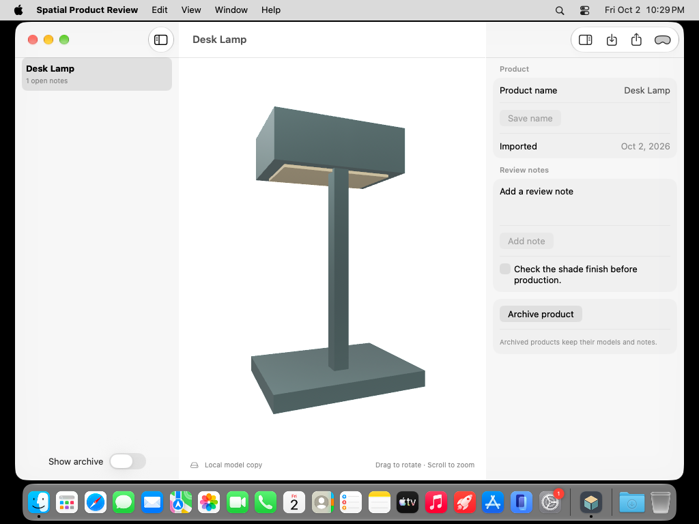

# Spatial Product Review

A Mac workspace for reviewing USDZ products, recording decisions, and presenting a model on Apple Vision Pro through Spatial Preview.



## Try it

Open **Spatial Product Review.xcodeproj** in Xcode 27 and run the **Spatial Product Review** scheme on macOS 27. The Mac target uses local ad-hoc signing; no developer team is embedded.

1. Choose **Add sample product** to load an original desk lamp, or import a USDZ model up to 100 MB.
2. Rotate and zoom the model in the native RealityKit preview. Rename the product and capture review notes; mark decisions resolved as the review progresses.
3. Choose **Present on Vision Pro**, select a device in Apple's picker, and complete the system's connection flow. **End presentation** closes the session before another model is presented.
4. Export a JSON review or archive a product. **Show archive** makes archived products available for restoration.

The sample is original procedural geometry; regenerate it with `python3 Scripts/GenerateSample.py`. Its dimensions use meters. Imported originals are copied into the app's private library and are not modified.

## What this demonstrates

- macOS 27 Spatial Preview: system device selection, asynchronous document sessions, observable connection state, and explicit session cleanup.
- Native RealityKit model inspection, split navigation, contextual review controls, and recoverable archiving.
- Actor-isolated, atomic JSON persistence with revision checks and bounded metadata; cancellable import/presentation tasks with stale-result protection.
- A self-contained USDZ asset generator, an original app icon, and real model-import/persistence tests.

This is a **Mac app** with a **visionOS 27 presentation destination**, not a separate headset app. Spatial Preview and visionOS Quick Look provide the presentation surface and their supported collaboration controls. Review notes remain local; this project does not implement shared note editing, CAD modeling, mesh editing, or custom SharePlay synchronization. Device discovery and the end-to-end headset presentation require compatible hardware and system configuration.

## Build and verify

```sh
swift test
swift test -c release
xcodebuild -project 'Spatial Product Review.xcodeproj' -scheme 'Spatial Product Review' -configuration Release -destination 'platform=macOS' build
bash Scripts/test-ui.sh
```

Core tests load an actual USDZ through Model I/O and verify original-byte preservation, saved notes, archive restoration, and stale-revision rejection. The native test exercises the sample, notes, relaunch, and archive workflow. Local UI test execution requires the normal Xcode testing permissions; hosted CI runs on the `xcode-27` image.

See [verification](Docs/Verification.md), [privacy](PRIVACY.md), and [contributing](CONTRIBUTING.md). MIT licensed.

## Framework references

[Spatial Preview](https://developer.apple.com/documentation/spatialpreview), [WWDC26 introduction](https://developer.apple.com/videos/play/wwdc2026/282/), and [Apple Human Interface Guidelines](https://developer.apple.com/design/human-interface-guidelines/).
